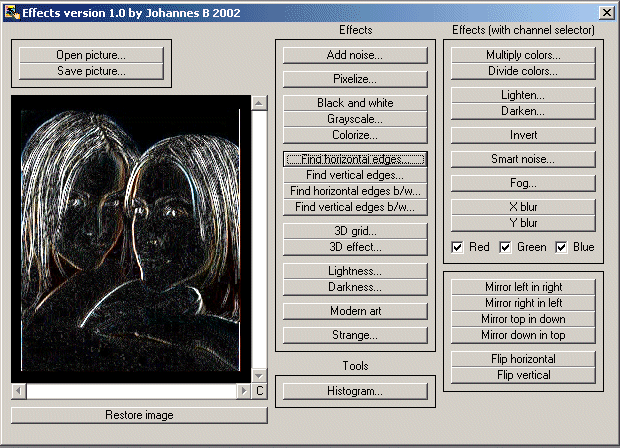



## Image Effects \+ Histogram\! \(30 effects\)

### Description

How about 30 image effects and a histogram function using Getpixel, Setpixel and BitBlt API. I know im not the first one to submit effects/filters.. but this one is very easy to understand. It is not as fast as some others but it can easily be modified. Effect list: Add noise, Pixelize, Black And White, Grayscale, Colorize, Find edges (horizontal and vertical), Find Edges b/w (horizontal and vertical), 3D Grid, 3D Effect, Lightness, Darkness, Modern Art, Strange, Multiply colors, Divide colors, Lighten, Darken, Invert, Smart Noise, Fog, Blur (horizontal and vertical) and some mirror/flip effects. You can also save your processed images.

(If you like the 3D effect please check out my heightmap code that is more advanced)
 
### More Info
 

             |
---                |---
**Submitted On**   |2002-12-16 16:44:50
**By**             |[Johannes B](https://github.com/Planet-Source-Code/PSCIndex/blob/master/ByAuthor/johannes-b.md)
**Level**          |Intermediate
**User Rating**    |4.9 (108 globes from 22 users)
**Compatibility**  |VB 5\.0, VB 6\.0
**Category**       |[Graphics](https://github.com/Planet-Source-Code/PSCIndex/blob/master/ByCategory/graphics__1-46.md)
**World**          |[Visual Basic](https://github.com/Planet-Source-Code/PSCIndex/blob/master/ByWorld/visual-basic.md)
**Archive File**   |[Image\_Effe1533191222003\.zip](https://github.com/Planet-Source-Code/johannes-b-image-effects-histogram-30-effects__1-42642/archive/master.zip)

